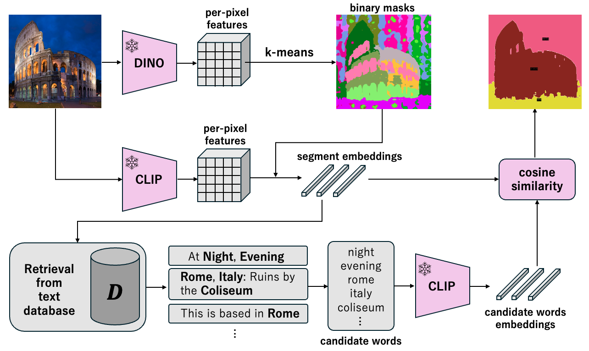
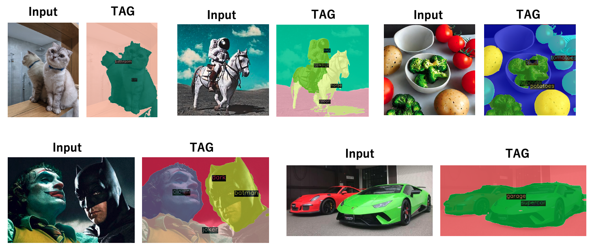

# TAG: Guidance-free Open-Vocabulary Semantic Segmentation
This repo is the official implementation of "TAG: Guidance-free Open-Vocabulary Semantic Segmentation".

TAG is a novel approach to open-vocabulary semantic segmentation that operates without the need for
training, annotation, or user guidance. It leverages pre-trained models like CLIP and DINO to
categorize each pixel in an image into meaningful classes, bypassing the traditional requirements for
pixel-level annotations and extensive training. By retrieving class labels from an external database,
TAG offers the flexibility to handle new scenarios and adapt to various contexts. Demonstrating
significant advancements, TAG has achieved state-of-the-art results on benchmark datasets such as
PascalVOC, PascalContext, and ADE20K, making it a promising solution for overcoming the limitations
of current semantic segmentation methods.




Our TAG can segment an image into meaningful segments without training, annotation, or guidance.
It successfully segments structures such as 'cat' and 'bathroom'. Unlike traditional open-vocabulary
semantic segmentation methods, TAG can segment and categorize without text-guidance.



## Installation

Install with Docker.

```sh
make build
```

To install docker to your environment, please refer to [this repository](https://github.com/Valkyrja3607/docker-template).

To download database, please run like below.

```sh
make download_database
```

## Dataset

Please set DATASET_DIR variable in Makefile to directory your dataset is containing.
The following structure is assumed.

```sh
── datasets
   ├── cityscapes
   ├── cocostuff
   └── VOCdevkit
```

## Run

To run TAG code, please run like below.

```sh
make run
```

To enter docker container, please run like below.

```sh
make bash
```

## Result

Result will be contained under outputs directory.
